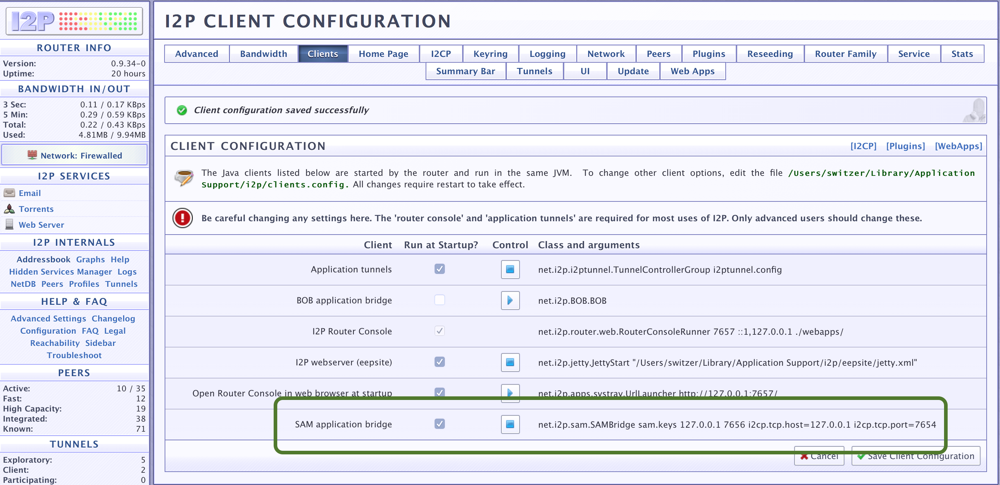

#  Building Anoncoin for OSX

[Home](../README.md) |
**[Installation](../README.md#quick-start)** |
[Developers](./doc/DEVELOPER.md) |
[Project](https://github.com/Anoncoin/anoncoin/projects/1)

[Linux](./INSTALLATION_LINUX.md) |
**OSX** |
[Windows](./INSTALLATION_WINDOWS.md)

Preparation
-----------

**Command Line Tools**

Ensure the OSX command line tools are installed:

```bash
xcode-select --install
```

When the popup appears, click `Install`.

**Homebrew**

Install [Homebrew](https://brew.sh) by running the following command:

```bash
/usr/bin/ruby -e "$(curl -fsSL https://raw.githubusercontent.com/Homebrew/install/master/install)"
```
**Other Dependencies**

Use Homebrew to install the dependencies on your machine:

```bash
brew update && brew upgrade
brew install automake berkeley-db4 boost git libevent librsvg libtool miniupnpc openssl pkg-config protobuf python3 qt
```

Installation From Source
------------------------

**Source Code**

Clone the Anoncoin source code and cd into `anoncoin`

```bash
git clone https://github.com/Anoncoin/anoncoin.git
cd anoncoin
```

Configure and build the headless Anoncoin binaries as well as the GUI:

**Set Flags**

Anoncoin needs to be compiled with a newer version of C++ than what is shipped with OSX:

```bash
export CXXFLAGS=-std=c++11
```

**Build**

Compile the Anoncoin code as follows:

```bash
./autogen.sh
./configure
make
```

*NOTE: You can pass in the following flags into `configure` if needed:*
* `--without-gui`: disable the GUI
* `--with-qt-incdir=/usr/local/opt/qt/include`: in case the QT `include` directory is not found
* `--with-qt-libdir=/usr/local/opt/qt/lib`: in case the QT `library` directory is not found

**Tests**

It is recommended to build and run the unit tests:

```bash
make check
```

**App Bundle**

You can also create a .dmg that contains the .app bundle:

```bash
make deploy
```

Configuration
-------------

**Config File**

Copy the conig file from the root directory to the default Anoncoin data directory:

```bash
cp ./anoncoin.conf.orig ~/Library/Application\ Support/Anoncoin/anoncoin.conf
```

**Bootstrap**

If you would like to (optionally) speed up the process of syncing the initial wallet, you can download a bootstrap file.

Navigate your browser to:

https://mega.nz/#!IqACmRhL!2Ti8rUlsnWoD4d5q3boMHQwaEbbqmxZqYq6FmWevVxI

Download the file.  Move the file to your data directory:

```bash
mv ~/Downloads/bootstrap.dat ~/Library/Application\ Support/Anoncoin
```


**Configure I2P**

Install and run the Invisible Internet Project (I2P):

```bash
brew install i2p
i2prouter start
```

Activate a SAM application bridge within I2P by navigating your browser to:

http://127.0.0.1:7657/configclients

Ensure that **SAM Appication Bridge** is running and configured to run at startup:



**Configure Anoncoin I2P Integration**

Fire up the Anoncoin daemon with the following I2P triggers:

```bash
./src/anoncoind -i2p.options.enabled=1 -onlynet=i2p -generatei2pdestination
```

This command will start Anoncoin, and will generate an I2P destination address.  The output of the script will tell you to paste text like the following to your `anoncoin.conf` file:

```
[i2p.mydestination]
static=1
privatekey=dDHYpWbQKHV75rmZg1FgnaoRjJQQ2vAwsXCz-9gFVNhWgUiGa~IP4uNacr36OGjMDxNFAw7jhWrYYlzki03mWuB-Pu5gxgdDUh-XudtwjNSFEWFEWFSDVSDFSERWEFVSDsdfsdfsdFSDFsdfsdfSDFSDFSDFWEFSFSDfsdfsERWERSDFSDFSSOtRnG0OEtUW7C3SPB5mT0zkvVbTdim5UydzuCWUNpJURJG-hjxW5CbmEClIphp2Vr2moxHpGOCjLWgBaysmdfljsdlfjsdlfjsdfjsdflkjsdfklsdjflkjsdlfksdfsdfsq1NaHi7ZDB7hIqxqW8CR1gIM6tD~rWlkUdGaAIVF0LbHYg1IzVHr8~FJkq0KPFIPg95DjeaXmU8r3fADA0GHZnw9LdR3TgV87Ih1WsZsPNZH0wHRUBIkKXcjLO1vXKOM2uzBLguHlkH~dXLzyWbYeg2gBuEg~7M6GU94XG6ZukhprTEzbNeKcQ4jaIli7~ARqOmCyJzodfsdfsdfsdfsdfsdfsdfsdfsdfsdfsdHWt-p3I2yVgpFzyr4hHPcDgzQrYbWzN~2k-8s~vSBc0I6G3-D2DgIPKi0V1C--vitSvkYTy-Wde-V0e1231345546756565345346457545645365675656343454533dlnnMYOdvOK83SNCUtKRq8171M8RsAtPGwCBgpDLgR1bZS~6E9-UfOQVCgoxyyB1O~ki0XxiTDglbH~02KK2dcfuxnLgqJc1RUul6ATcfaeyTxCoITe2TXkAR6JLlI2uiS~Pm0RhdAkMZ58NEkhCose0EXasK9hoWFlem9xLhgn4owGdRF7WM4UdhDQP-qj5MOSHeMdr-krQty-Z-XJc~

[i2p.options]
enabled=1
```
Edit your `anoncoin.conf`, paste the `privatekey` from your output to the `i2p.mydestination` section of the config file, and save the file:

```bash
vi ~/Library/Application\ Support/Anoncoin/anoncoin.conf
```
